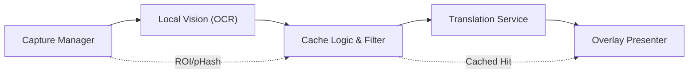
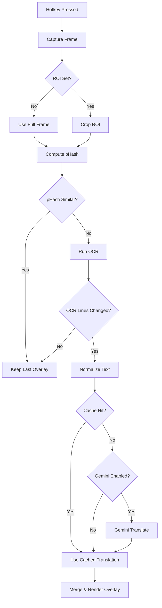
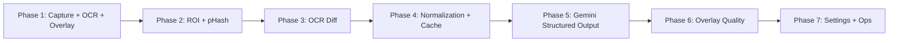

# Mermaid Diagrams

## Architecture Overview

```mermaid
flowchart LR
    A[Capture Manager] --> B["Local Vision (OCR)"]
    B --> C[Cache Logic & Filter]
    C --> D[Translation Service]
    D --> E[Overlay Presenter]
    A -. ROI/pHash .-> C
    C -. Cached Hit .-> E
```

## Hotkey Pipeline

```mermaid
flowchart TD
    H[Hotkey Pressed] --> C[Capture Frame]
    C --> R{ROI Set?}
    R -- No --> F[Use Full Frame]
    R -- Yes --> S[Crop ROI]
    F --> P[Compute pHash]
    S --> P
    P --> Q{pHash Similar?}
    Q -- Yes --> K[Keep Last Overlay]
    Q -- No --> O[Run OCR]
    O --> D{OCR Lines Changed?}
    D -- No --> K
    D -- Yes --> N[Normalize Text]
    N --> L{Cache Hit?}
    L -- Yes --> M[Use Cached Translation]
    L -- No --> G{Gemini Enabled?}
    G -- No --> M
    G -- Yes --> T[Gemini Translate]
    T --> M
    M --> V[Merge & Render Overlay]
```

## Phase Roadmap

```mermaid
flowchart LR
    P1[Phase 1: Capture + OCR + Overlay]
    P2[Phase 2: ROI + pHash]
    P3[Phase 3: OCR Diff]
    P4[Phase 4: Normalization + Cache]
    P5[Phase 5: Gemini Structured Output]
    P6[Phase 6: Overlay Quality]
    P7[Phase 7: Settings + Ops]

    P1 --> P2 --> P3 --> P4 --> P5 --> P6 --> P7
```
